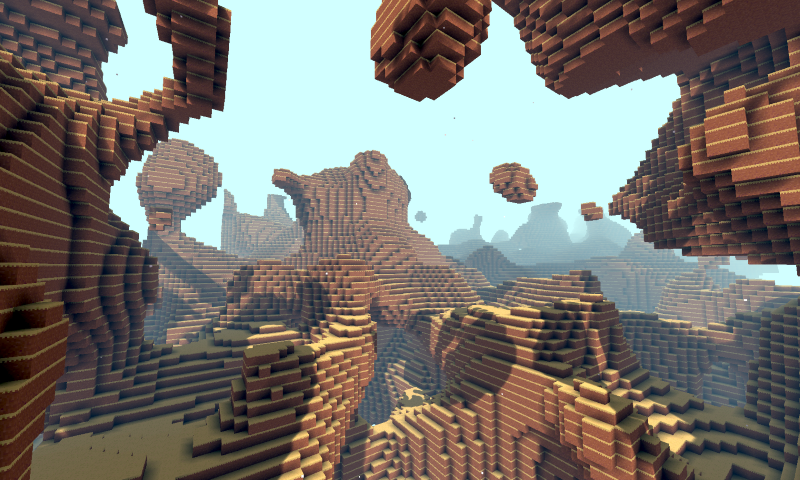
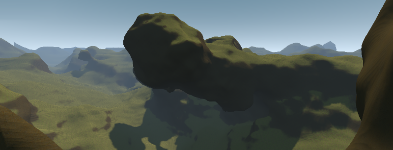

Voxel Tools for Godot
=========================

A voxel terrain engine for Godot Engine 4, **fully ported from C++ to Rust**.

This fork is a **pure Rust GDExtension** — no C++ module code remains. The
engine core (`voxel-core`) is engine-agnostic and fully unit-testable; the
thin Godot binding (`voxel-gdext`) exposes 79 functional classes via
`#[func]` methods. Loads in Godot 4.7+.

> **Verified by independent audit (2026-07-30):** 1489 tests pass (0 failed),
> `cargo clippy --workspace --all-targets` is warning-clean, `cargo fmt --check`
> passes, and `voxel-core` cross-compiles to Android `aarch64`.




Features
---------------------------

- Realtime 3D terrain editable in-game (overhangs, tunnels, creation/destruction)
- Polygon-based: voxels are transformed into chunked meshes via the Transvoxel algorithm
- Godot physics integration + fast Minecraft-like collisions
- Infinite terrains via multi-LOD paging (LodOctree + transition cells)
- Voxel data streaming (memory, region files, generators)
- Minecraft-style blocky terrain with baked ambient occlusion
- Smooth terrain with level of detail (Transvoxel + SINGLE_S4 texturing)
- Procedural graph generator (24+ node types, expression nodes, image lookups)
- Voxel instancing system (scatter foliage, rocks on surfaces)
- **Pure Rust** — cross-compiles to Android (aarch64/x86_64), iOS, macOS

Building
---------------

This is a **native GDExtension** — you compile it to a `.so`/`.dylib`/`.dll`,
then point a `.gdextension` file at it. Quick start:

```bash
cd rust
cargo build -p voxel-gdext --release    # → rust/target/release/libvoxel_gdext.so
```

For the full integration walkthrough (every platform: Linux/Windows/macOS,
Android, iOS; the `.gdextension` setup; debug vs release; verifying it loads),
see **[Integration guide](rust/docs/INTEGRATION.md)**.

Testing
---------------

```bash
cd rust
cargo test --workspace                      # 1494 tests (0 failed)
cargo clippy --workspace --all-targets      # warning-clean
cargo fmt --check                           # clean
```

Project structure
---------------

```
rust/
├── voxel-core/          # Engine-agnostic Rust core (all logic)
│   ├── src/             # 800 unit tests
│   └── tests/           # 674 parity tests + integration + transvoxel parity
├── voxel-gdext/         # Godot GDExtension binding (79 classes)
│   ├── src/             # #[func] methods delegating to voxel-core
│   └── smoke_test/      # Godot 4.7 project + VoxelGeneratorGraph addon
├── cpp-baseline/        # C++ parity harness (reference data generation)
├── tsan/                # ThreadSanitizer tests
└── fuzz/                # cargo-fuzz targets
```

Status
---------------

The C++ → Rust migration is **complete**. The original C++ module is fully
removed; the project is a pure-Rust GDExtension verified in Godot 4.7.1:

- **1494 tests pass** (800 unit + 674 parity + 5 integration + 5 transvoxel
  parity + 1 stress + 5 TSan + 3 gdext unit + 1 doc-test), clippy/fmt clean.
- **79 Godot classes** functional, registered under canonical upstream names
  (`VoxelBuffer`, `VoxelMesherBlocky`, `VoxelTerrain`, …).
- Full paging + generation + meshing pipeline runs end-to-end (verified headless:
  210 mesh blocks generated).

Remaining big features (blocky model library on terrain, `VoxelLodTerrain`
paging/rendering, multiplayer areas, full terrain tools, instancing
rendering, graph editor) are tracked in **[ROADMAP.md](ROADMAP.md)**.

Class names follow upstream godot_voxel (`#[class(rename=…)]`); see
[`AGENTS.md`](AGENTS.md) for the naming scheme.

Documentation
---------------

- [AGENTS.md](AGENTS.md) — repo guide for AI agents and contributors (architecture,
  crate layout, build/test/smoke commands, conventions).
- [Integration guide](rust/docs/INTEGRATION.md) — how to build the extension and
  load it in a Godot project (Linux/Windows/macOS/Android/iOS).
- [Rust gdext binding](rust/voxel-gdext/README.md) — build, load, and verify in Godot.
- [Original upstream docs](https://voxel-tools.readthedocs.io/en/latest/)

Credits
---------------

Originally developed by [Zylann](https://github.com/Zylann/godot_voxel).
Rust port by the community. See the supporter list in the original project.
